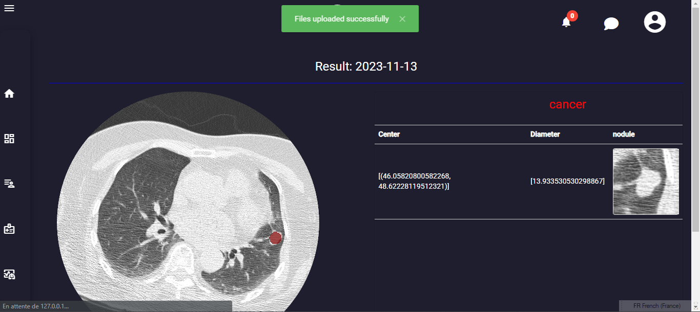

# Lung Cancer Diagnostic Web Application

<div align="center">
  
</div>

## Introduction

The Lung Cancer Diagnostic Web Application is a platform for early detection of lung cancer using deep learning techniques. It provides users with a convenient way to upload lung images and receive diagnostic results based on deep learning algorithms.

## Features

- <strong>User Authentication:</strong> Users can register new accounts or log in with existing ones to access the application.
- <strong>Image Upload:</strong> Users can upload lung images for analysis.
- <strong>Diagnostic Results:</strong> Users can view diagnostic results generated by deep learning algorithms.
- <strong>Dashboard:</strong> Provides a dashboard for visualization of diagnostic trends and statistics.
- <strong>Admin Panel:</strong> Administrators can manage users and diagnostic data through the admin panel.

## Technologies Used

- <strong>Backend:</strong>
  - Django: Python-based web framework for backend development
  - MongoDB: NoSQL database for storing diagnostic data
  - Deep Lab: Deep learning model for lung cancer diagnosis
  
- <strong>Frontend:</strong>
  - Angular: Frontend framework for building dynamic web applications
  
## Setup

### Prerequisites

Make sure you have the following software installed:

- Python 3.x
- Node.js
- MongoDB

### Installation

1. Clone the repository:
git clone https://github.com/marnissiahmed/lung-cancer-AI-base-web-solution.git
cd lung-cancer-AI-base-web-solution

markdown
Copy code

2. Install backend dependencies:
   ```
   pip install -r backend/application/requirements.txt
   ```


markdown
Copy code

3. Install frontend dependencies:
cd frontend/lungdiagnostic
```
npm install
```
4. Set up MongoDB:
- Install MongoDB and start the MongoDB service.
- Create a MongoDB database for your application.

5. Configure settings:
- Rename `example.env` to `.env` and configure environment variables such as `SECRET_KEY`, `DATABASE_URL`, and `DEBUG`.

6. Run migrations:
cd backend/application
python manage.py migrate

markdown
Copy code

7. Compile frontend assets:
cd frontend/lungdiagnostic
npm run build
## projec Map
```
+ frontend
  |__ lungdiangnostic * contains the code source of angular front end
      - src
      - app
        - addpatient
        - addscan
        - analyse
        - dash
        - details
        - home
        - login
        - navbar
        - patientlist
        - paymentandinfo
        - profile
        - repport
        - statepage
        - treatement
        - traitment-detais
+ deeplearning
  |__data preprossing
  |__models
  |__test
+backend
  |__application
     |__application
      |__lungdiagnostic * contains the django application 
      |__ diagnostic    * contains the intellgence model for lung cancer diagnostic
```
## Usage

1. Register a new account or log in with an existing one.
2. Upload a lung image for diagnosis.
3. View diagnostic results on the dashboard.

## Contributing

Contributions are welcome! Follow these steps to contribute:

1. Fork the repository.
2. Create a new branch (`git checkout -b feature/your_feature`).
3. Commit your changes (`git commit -am 'Add new feature'`).
4. Push to the branch (`git push origin feature/your_feature`).
5. Create a new pull request.

Please follow the <a href="CODE_OF_CONDUCT.md">code of conduct</a> while contributing.

## License

This project is licensed under the <a href="LICENSE">MIT License</a>.

## Authors

- Ahmed Marnissi (<a href="https://github.com/marnissiahmed">@marnissiahmed</a>)


[]([https://www.youtube.com/watch?v=yjawzRhKpOs "]
