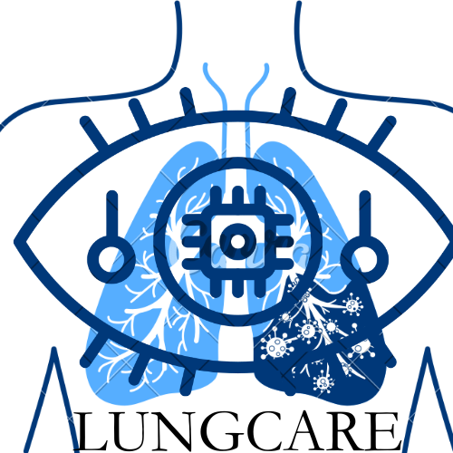

# Lung Cancer Diagnostic Web Application

## Introduction

The Lung Cancer Diagnostic Web Application is a platform for early detection of lung cancer using deep learning techniques. It provides users with a convenient way to upload lung images and receive diagnostic results based on deep learning algorithms.

## Features

- **User Authentication:** Users can register new accounts or log in with existing ones to access the application.
- **Image Upload:** Users can upload lung images for analysis.
- **Diagnostic Results:** Users can view diagnostic results generated by deep learning algorithms.
- **Dashboard:** Provides a dashboard for visualization of diagnostic trends and statistics.
- **Admin Panel:** Administrators can manage users and diagnostic data through the admin panel.

## Technologies Used

- **Backend:**
  - Django: Python-based web framework for backend development
  - MongoDB: NoSQL database for storing diagnostic data
  - Deep Lab: Deep learning model for lung cancer diagnosis
  
- **Frontend:**
  - Angular: Frontend framework for building dynamic web applications
  
## Setup

### Prerequisites

Make sure you have the following software installed:

- Python 3.x
- Node.js
- MongoDB

### Installation

1. Clone the repository:
git clone https://github.com/marnissiahmed/lung-cancer-AI-base-web-solution.git
cd your_repository

markdown
Copy code

2. Install backend dependencies:
pip install -r backend/application/requirements.txt

markdown
Copy code

3. Install frontend dependencies:
cd frontend/lungdiagnostic
npm install

markdown
Copy code

4. Set up MongoDB:
- Install MongoDB and start the MongoDB service.
- Create a MongoDB database for your application.

5. Configure settings:
- Rename `example.env` to `.env` and configure environment variables such as `SECRET_KEY`, `DATABASE_URL`, and `DEBUG`.

6. Run migrations:
cd backend/application
python manage.py migrate

markdown
Copy code

7. Compile frontend assets:
cd frontend/lungdiagnostic
npm run build

less
Copy code

## Usage

1. Register a new account or log in with an existing one.
2. Upload a lung image for diagnosis.
3. View diagnostic results on the dashboard.

## Contributing

Contributions are welcome! Follow these steps to contribute:

1. Fork the repository.
2. Create a new branch (`git checkout -b feature/your_feature`).
3. Commit your changes (`git commit -am 'Add new feature'`).
4. Push to the branch (`git push origin feature/your_feature`).
5. Create a new pull request.

Please follow the [code of conduct](CODE_OF_CONDUCT.md) while contributing.

## License

This project is licensed under the [MIT License](LICENSE).

## Authors

- John Doe ([@marnissiahmed](https://github.com/marnissiahmed))
  

## Acknowledgements

- Deep Lab contributors
- Django contributors
- Angular contributors
